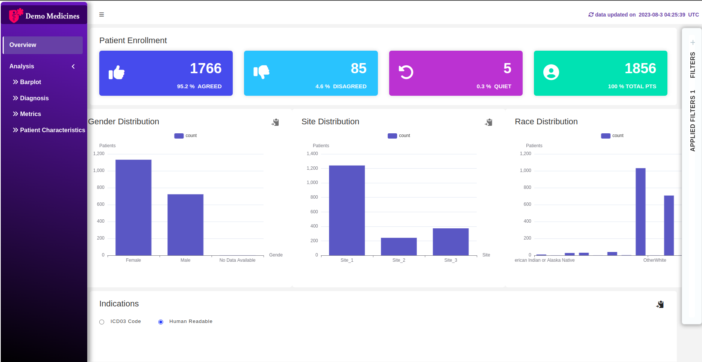
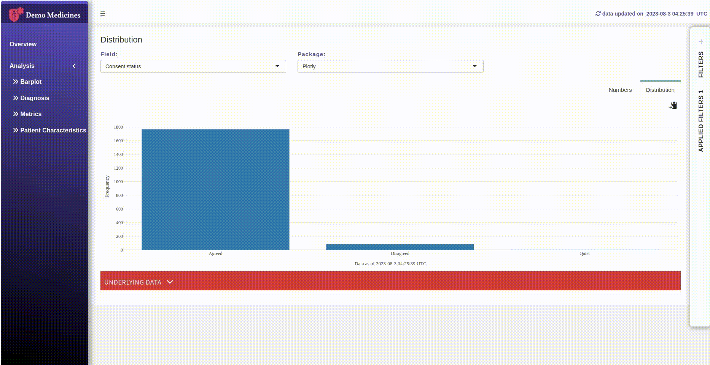
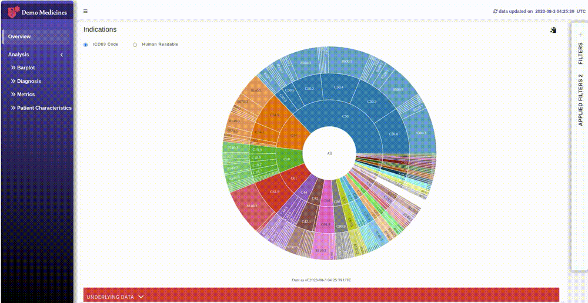
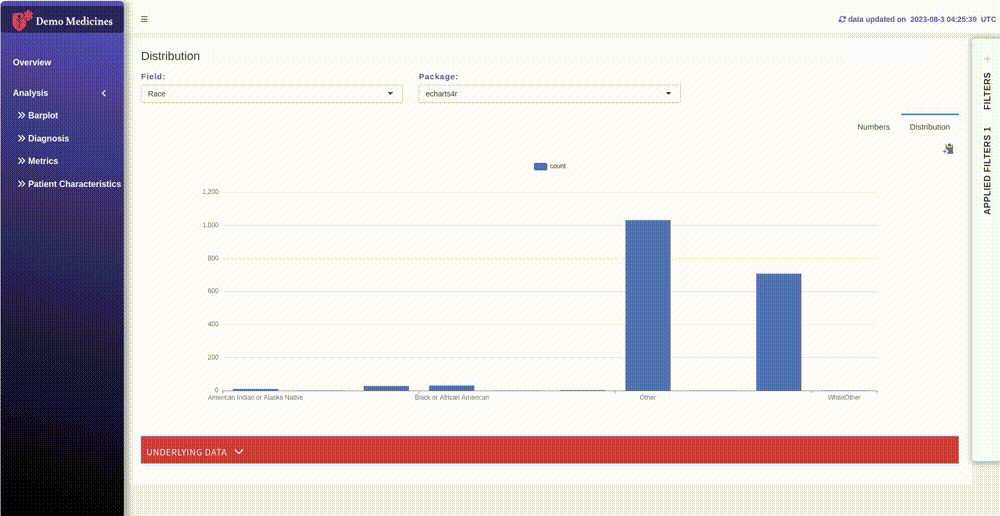
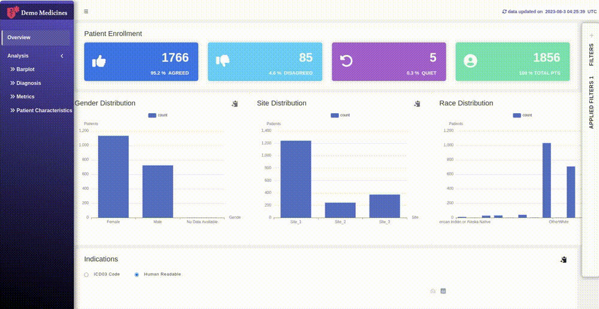
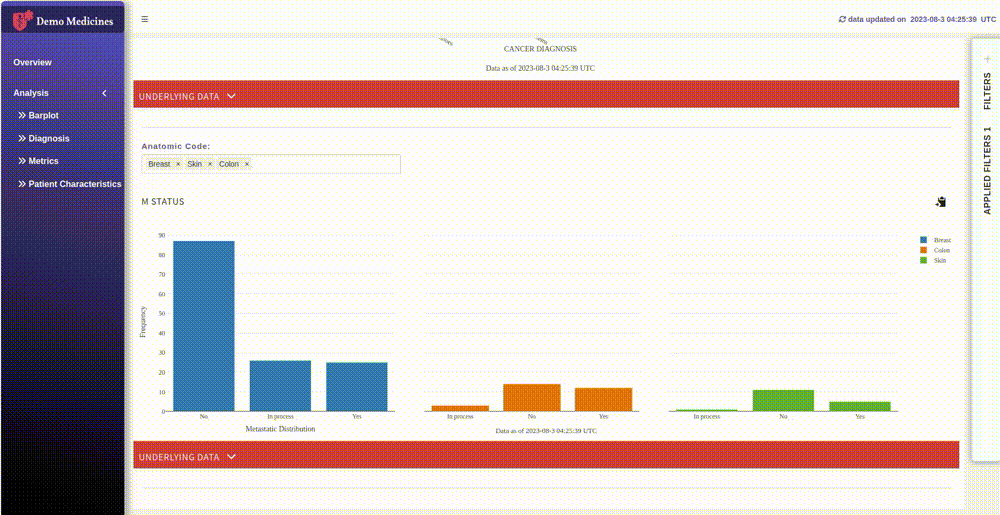

# Clinical Data Analysis Dashboard

### Overview
This project is organized using the Rhino file structure to ensure a scalable and maintainable R Shiny application. The Rhino structure promotes best practices such as modularization, separation of concerns, and the use of external resources. Key directories include R/ for main application scripts, modules/ for UI and server components, www/ for static assets like CSS, JS, and images, and data/ for datasets.

### Key Features

#### Rhino Package to maintain clean file structure
To set up and structure your R Shiny dashboard project using the Rhino file structure, you'll need to organize your files into directories that promote modularity and separation of concerns. The typical Rhino structure includes directories for R scripts (R/ for server.R and ui.R), modules (modules/ for individual module UI and server scripts), static resources (www/ for CSS, JS, and images), and data files (data/). This structure helps maintain clean, maintainable, and scalable Shiny applications.

#### Patient Demographics Analysis
This section of the dashboard offers an in-depth analysis of the demographic distribution among cancer patients. Key features include:

- **Age Distribution**: Visual representation of the age range of patients, highlighting the most affected age groups.

- **Gender Distribution**: Analysis of the proportion of male and female patients, aiding in understanding gender-specific cancer trends.

- **Ethnicity and Geographic Distribution**: Insights into the ethnic backgrounds and geographic locations of the patients, helping identify region-specific patterns.

### Consent Analysis
Understanding patient consent is crucial for clinical research. This section analyzes:

- **Consent Rates**: Percentage of patients who have consented to participate in various clinical trials.

- **Demographic Correlations**: Relationship between demographic factors and consent rates, identifying groups that may need additional engagement.

### ICD Codes Analysis
ICD codes are essential for categorizing diagnoses and procedures. This section provides:

- **Diagnosis Frequency**: Analysis of the most common diagnoses among the patients, which helps prioritize clinical resources.

- **Procedure Analysis**: Examination of the most frequently performed medical procedures, providing insights into treatment patterns.

### Advanced Data Visualizations
The dashboard incorporates a variety of advanced visualizations, enhancing the analytical experience:

- **Multiple Visualization Packages**: Utilizes diverse data visualization libraries, such as Plotly and echarts4r, to create interactive and dynamic visualizations that enrich user engagement.

- **Interactive Charts**: Dynamic charts that allow users to filter and drill down into specific data subsets.

- **Predictive Analytics**: Models to forecast future trends based on historical data, aiding in proactive healthcare planning.

- **Geospatial Analysis**: Visualization of geographic distribution of patients and cancer prevalence, identifying hotspots for targeted interventions.

### Advanced Filters
Implementing advanced filtering options allows users to customize their analyses by selecting specific subsets of data based on various criteria. This feature enhances the dashboard's flexibility and usability.

### Export Functionality
The dashboard supports extensive export options, allowing users to download charts and tables in various formats:

Here is the git url to exported outputs, [Exported plots](https://github.com/sailkargutkar/demo_r_shiny_project/tree/main/exported_plots "Exported plots")

- **Export Options**: Users can export visualizations and tables as R Markdown documents, ZIP files, or PDFs, facilitating easy sharing and reporting of findings.

## Below necessary Linux packages need to install first

        1. sudo apt-get install libfontconfig1-dev libfreetype6-dev

        2. find /usr -name fontconfig.pc

        3. export PKG_CONFIG_PATH=\$(find /usr -name fontconfig.pc):\$PKG_CONFIG_PATH
    
        4. sudo apt-get install libcairo2-dev
    
        5. sudo apt-get install libcairo2-dev libudunits2-dev
    
        6. sudo apt-get install gdal-bin libgdal-dev
    
        7. sudo apt-get install librsvg2-dev

## To run project first time on new machine

        install.packages('renv')   
        library(renv)
		renv::restore()
		Choose option "1: Activate the project and use the project library."

## Once installation done, you can run the app using below command,

        rhino::app()

## If you already have project, then simply run below command.

        rhino::app()

## Packages to be needed.

    -   library(rhino)
    -   library(shiny)
    -   library(plotly)
    -   library(pool)
    -   library(RPostgres)
    -   library(sass)
    -   library(shinydashboard)
    -   library(DBI)
    -   library(htmlwidgets)
    -   library(rmarkdown)
    -   library(dplyr)
    -   library(rjson)
    -   library(lubridate)
    -   library(tidyverse)
    -   library(haven)
    -   library(aws.s3)
    -   library(aws.ec2metadata)
    -   library(shinydashboardPlus)
    -   library(ISOweek)
    -   library(clock)
    -   library(stringr)
    -   library(shinycssloaders)
    -   library(shinypanels)
    -   library(rtables)
    -   library(tern)
    -   library(tinytex)
    -   library(rlang)
	-   library(tinytex)

## There is a possibility to occurred below listed errors, if you run project first time on new machine.

    1.  Error 1: lattice package error "sh: 1: make: not found"

        Solution 1: sudo apt-get install build-essential

    2. Error 2: '/usr/bin/ld: cannot find -lgfortran: No such file or directory'

        install of package 'Matrix' failed error code 1

        Solution 2: sudo apt-get install gfortran

    3. Error 3: install of package 'RPostgres' failed error code 1

        Solution 3: sudo apt-get install libpq-dev

    4. Error 4: configuration failed for package 'curl'

        install of package 'curl' failed error code 1

        Solution 4: sudo apt-get install libcurl4-openssl-dev

    5. Error 5: install of package 'httpuv' failed error code 1 gzipdatasource.h:4:10:

        zlib.h: No such file or directory

        Solution 5: sudo apt-get install libz-dev

## Code Referrences
### Javascript 
[Javascript code referrence 1](https://github.com/sailkargutkar/demo_r_shiny_project/blob/9d89c76c3dfb69aad352b02b9bdf33c8c49cfdfa/app/main.R#L50)
[Javascript code referrence 2](https://github.com/sailkargutkar/demo_r_shiny_project/blob/9d89c76c3dfb69aad352b02b9bdf33c8c49cfdfa/app/main.R#L358)
- The script manages connection intervals for a Shiny application, starting an interval to log a message every 50 seconds when connected and clearing it when disconnected.
- It also simulates a click on a specific radio button when the document is ready to ensure that the desired radio button is selected automatically.
- This combination of event handling and DOM manipulation helps maintain the desired application state and user interface behavior.

### External CSS
[CSS code](https://github.com/sailkargutkar/demo_r_shiny_project/tree/main/app/styles)
##### External CSS Reference and Custom Styling
In this project, we have integrated external CSS references to manipulate the default theme and enhance the visual presentation of our Shiny application. The default theme CSS has been overridden with custom styles to meet specific design requirements. Additionally, we have utilized media queries to ensure a responsive and adaptive layout across various devices and screen sizes

##### External CSS Reference
We have linked external CSS files to leverage predefined styles and layout frameworks. This approach allows us to quickly implement a consistent and professional look and feel across the application.

##### Custom CSS Overrides
To customize the appearance further, we have overridden the default theme CSS with our custom styles. These overrides enable us to tailor the design to our specific needs, ensuring a unique and cohesive visual identity.

##### Responsive Design with Media Queries
To ensure the application is accessible and visually appealing on various devices, we have implemented media queries. These allow us to apply different styles based on the screen size, providing an optimal user experience on desktops, tablets, and mobile devices.

### Rlang Package

#### Referrence 1
[Function definition code](https://github.com/sailkargutkar/demo_r_shiny_project/blob/9d89c76c3dfb69aad352b02b9bdf33c8c49cfdfa/app/logic/utils/common_utils.R#L806)

[Function calling code](https://github.com/sailkargutkar/demo_r_shiny_project/blob/9d89c76c3dfb69aad352b02b9bdf33c8c49cfdfa/app/view/demo_analysis_barplot.R#L139)

- The custom function summarise_count leverages tidy evaluation to dynamically group data by a specified variable.
- It uses the enquo function from the rlang package to capture and quote the grouping variable.
- The group_by function groups the data, and summarise calculates the count of observations within each group.
- This function is useful for dynamically summarising data based on different grouping variables without having to hard-code them.

#### Referrence 2
[Rlang::sym()](https://github.com/sailkargutkar/demo_r_shiny_project/blob/5c3c45323df68d3b99e0511ebecd5a243eaaf4d3/app/view/demo_analysis_barplot.R#L139)
Converts the string input$var into a symbol. This allows us to use the variable name dynamically in echarts4r barplot.
